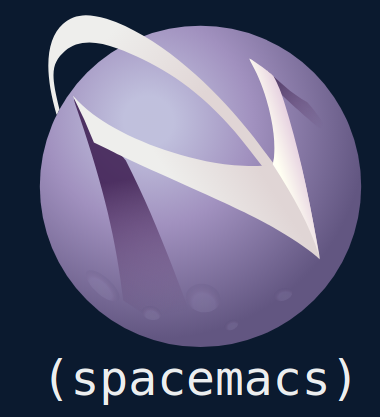

# Running spacemacs server using systemd user unit



This repo contains the `stow` managed systemd unit file. `stow` drops the unit
file in `~/.local/share/systemd/user/`.

Do `make install`

```
.
├── dot/
│   └── .local/
│       └── share/
│           └── systemd/
│               └── user/
│                   └── emacs.service
```


| Action                    | systemd command                 |
| ---                       | ---                             |
| Enable at user login time | `systemctl --user enable emacs` |
| Start now                 | `systemctl --user start emacs`  |

# Sources
 - https://streakycobra.github.io/posts/saas-or-spacemacs-as-a-service/
 - https://news.ycombinator.com/item?id=9394144
